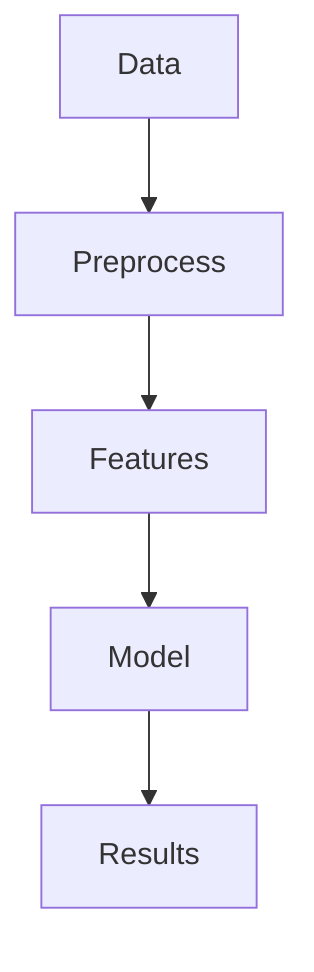

# Theme Showcase

Explore all 9 color themes and 8 font themes

---
layout: section
---

# Part 1: Color Themes

## 9 professionally designed color palettes

Each theme has a dedicated example file for live preview:

| Theme | Example File |
|-------|-------------|
| Classic Blue | `pnpm run dev -- examples/example-classic-blue.md` |
| Oxford Burgundy | `pnpm run dev -- examples/example-oxford.md` |
| Cambridge Green | `pnpm run dev -- examples/example-cambridge.md` |
| Yale Blue | `pnpm run dev -- examples/example-yale.md` |
| Princeton Orange | `pnpm run dev -- examples/example-princeton.md` |
| Nordic Blue | `pnpm run dev -- examples/example-nordic.md` |
| Monochrome | `pnpm run dev -- examples/example-monochrome.md` |
| Warm Sepia | `pnpm run dev -- examples/example-sepia.md` |
| High Contrast | `pnpm run dev -- examples/example-high-contrast.md` |

---
layout: default
title: Classic Academic Blue
subtitle: Default Theme
---

## Classic Academic Blue

The default theme inspired by traditional academic institutions.

```yaml
themeConfig:
  colorTheme: classic-blue
```

**Colors:**
- Primary: `#1e3a5f` (Deep Academic Blue)
- Accent: `#b8860b` (Academic Gold)
- Background: `#fdfbf7` (Warm Ivory)

<Block type="info" title="Best For">

Traditional academic presentations, conferences, and formal lectures.

</Block>

---
layout: default
title: Oxford Burgundy
---

## Oxford Burgundy

Rich burgundy inspired by Oxford University.

```yaml
themeConfig:
  colorTheme: oxford-burgundy
```

**Colors:**
- Primary: `#862633` (Oxford Burgundy)
- Accent: `#c5a572` (Antique Gold)

<Block type="default" title="Characteristics">

Elegant, distinguished, and commanding attention.

</Block>

---
layout: default
title: Cambridge Green
---

## Cambridge Green

Classic green reminiscent of Cambridge University.

```yaml
themeConfig:
  colorTheme: cambridge-green
```

**Colors:**
- Primary: `#00543c` (Cambridge Green)
- Accent: `#d4af37` (Gold)

---
layout: default
title: Princeton Orange
---

## Princeton Orange

Vibrant orange from Princeton University.

```yaml
themeConfig:
  colorTheme: princeton-orange
```

**Colors:**
- Primary: `#e87722` (Princeton Orange)
- Accent: `#1c1c1c` (Black)

---
layout: default
title: Yale Blue
---

## Yale Blue

Traditional Yale blue for a polished look.

```yaml
themeConfig:
  colorTheme: yale-blue
```

**Colors:**
- Primary: `#0f4d92` (Yale Blue)
- Accent: `#d4af37` (Gold)

---
layout: default
title: Monochrome
---

## Monochrome Professional

Clean, professional grayscale palette.

```yaml
themeConfig:
  colorTheme: monochrome
```

**Colors:**
- Primary: `#2d3748` (Dark Gray)
- Accent: `#718096` (Medium Gray)

---
layout: default
title: Warm Sepia
---

## Warm Sepia

Warm, inviting sepia tones for a vintage feel.

```yaml
themeConfig:
  colorTheme: warm-sepia
```

**Colors:**
- Primary: `#5d4037` (Sepia Brown)
- Accent: `#d4a574` (Warm Tan)

---
layout: default
title: Nordic Blue
---

## Nordic Blue

Calm, Scandinavian-inspired blue palette.

```yaml
themeConfig:
  colorTheme: nordic-blue
```

**Colors:**
- Primary: `#2e5266` (Nordic Blue)
- Accent: `#d4a762` (Warm Gold)

---
layout: default
title: High Contrast
---

## High Contrast (Accessibility)

Maximum contrast for accessibility needs.

```yaml
themeConfig:
  colorTheme: high-contrast
```

**Colors:**
- Primary: `#000000` (Black)
- Accent: `#0066cc` (Blue)
- Background: `#ffffff` (White)

<Block type="success" title="Accessibility">

WCAG AAA compliant contrast ratios for maximum readability.

</Block>

---
layout: section
---

# Part 2: Font Themes

## 8 carefully crafted typography combinations

---
layout: default
title: Classic Palatino
---

## Classic Palatino (Default)

Traditional academic typography with Palatino serif.

```yaml
themeConfig:
  fontTheme: classic
```

**Fonts:**
- Serif: Palatino Linotype, Book Antiqua
- Sans: Helvetica Neue, Helvetica

---
layout: default
title: Modern Academica
---

## Modern Academica

Contemporary academic look with Georgia serif.

```yaml
themeConfig:
  fontTheme: modern
```

**Fonts:**
- Serif: Georgia, Cambria
- Sans: Source Sans Pro, Segoe UI

---
layout: default
title: Traditional Garamond
---

## Traditional Garamond

Classic elegance with Garamond typography.

```yaml
themeConfig:
  fontTheme: traditional
```

**Fonts:**
- Serif: Garamond, Baskerville
- Sans: Gill Sans, Optima

---
layout: default
title: Contemporary Sans
---

## Contemporary Sans

Modern sans-serif focused typography.

```yaml
themeConfig:
  fontTheme: contemporary
```

**Fonts:**
- Serif: Charter, Georgia
- Sans: Inter, SF Pro Display

---
layout: default
title: Humanist
---

## Humanist

Warm, readable humanist typefaces.

```yaml
themeConfig:
  fontTheme: humanist
```

**Fonts:**
- Serif: Crimson Text, Libre Baskerville
- Sans: Open Sans, Noto Sans

---
layout: default
title: Technical
---

## Technical

LaTeX-inspired typography for technical content.

```yaml
themeConfig:
  fontTheme: technical
```

**Fonts:**
- Serif: Computer Modern, Latin Modern
- Sans: IBM Plex Sans, Roboto

---
layout: default
title: Elegant Serif
---

## Elegant Serif

Refined, sophisticated serif typography.

```yaml
themeConfig:
  fontTheme: elegant
```

**Fonts:**
- Serif: Cormorant Garamond, EB Garamond
- Sans: Montserrat, Lato

---
layout: default
title: Sans Default
---

## Sans Default

Sans-serif focused for modern presentations.

```yaml
themeConfig:
  fontTheme: sans-default
```

**Fonts:**
- Primary: Inter, SF Pro Display, system-ui
- Fallback: Georgia for serif content

<Block type="info" title="Recommended">

Best for tech talks, startup pitches, and modern conferences.

</Block>

---
layout: section
---

# Part 3: New Layouts (v2.0)

## 6 additional layouts for diverse needs

---
layout: timeline
title: Research Timeline
items:
  - year: "2020"
    title: Initial Research
    description: Began exploring the problem space
  - year: "2021"
    title: Methodology Development
    description: Developed core algorithms
  - year: "2022"
    title: Validation
    description: Conducted experiments and validation
  - year: "2023"
    title: Publication
    description: Published findings in top venues
---

---
layout: agenda
title: Today's Agenda
items:
  - Introduction and Background
  - Methodology Overview
  - Experimental Results
  - Discussion and Future Work
  - Q&A Session
---

---
layout: methodology
ratio: "1:1"
title: Research Methodology
subtitle: Two-column layout
---

## Our Approach

1. **Data Collection**
   - Gathered from multiple sources
   - Preprocessed for quality

2. **Analysis Pipeline**
   - Feature extraction
   - Model training

3. **Validation**
   - Cross-validation
   - External benchmarks

::right::



---
layout: results
cols: 2
title: Key Results
---

<div class="p-4 bg-white rounded shadow">

### Accuracy

# 94.7%

Best in class

</div>

<div class="p-4 bg-white rounded shadow">

### Speed

# 2.3x

Faster than baseline

</div>

<div class="p-4 bg-white rounded shadow">

### Memory

# -40%

Reduced footprint

</div>

<div class="p-4 bg-white rounded shadow">

### Latency

# 15ms

Real-time capable

</div>

---
layout: acknowledgments
title: Acknowledgments
funders:
  - National Science Foundation
  - Department of Energy
  - University Research Grant
collaborators:
  - MIT AI Lab
  - Stanford NLP Group
  - Google Research
---

Special thanks to all contributors and reviewers.

---
layout: split-image
images:
  - https://images.unsplash.com/photo-1507003211169-0a1dd7228f2d?w=400
  - https://images.unsplash.com/photo-1494790108377-be9c29b29330?w=400
captions:
  - Before optimization
  - After optimization
title: Visual Comparison
---

---
layout: section
---

# Combining Themes

## Mix and match colors and fonts

---
layout: default
title: Theme Combinations
---

## Recommended Combinations

| Color Theme | Font Theme | Best For |
|-------------|------------|----------|
| classic-blue | classic | Traditional academic |
| oxford-burgundy | traditional | Humanities, History |
| cambridge-green | elegant | Life Sciences |
| yale-blue | modern | Social Sciences |
| princeton-orange | contemporary | Engineering, Tech |
| monochrome | sans-default | Modern, Minimal |
| nordic-blue | humanist | Design, Arts |
| high-contrast | technical | Accessibility |

---
layout: center
---

## Thank You

Explore all themes at [scholarly.jxpeng.dev](https://scholarly.jxpeng.dev)
