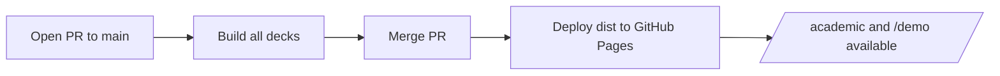

# Aurora Launch Deck

同一个仓库，同时部署第二套 Slidev 演示稿。

  GitHub Pages 路径：<code>/demo/</code>

---
layout: section
---

# Why This Demo Exists

- 验证一个仓库可并行部署多套 slide
- 展示每套 slide 都有独立访问路径
- 保留共享组件、依赖和 CI/CD 流程

---
layout: center
---

# Release Flow

---
layout: default
---

## Launch Metrics

| Metric | Value | Note |
| --- | ---: | --- |
| Build targets | 2 | `academic`, `demo` |
| Repository | 1 | Shared CI/CD |
| Deploy trigger | Merge to `main` | Only after review |

---
layout: end
---

# Thank You

未来只要继续往清单里追加 entry，就可以扩展到更多 slide。
